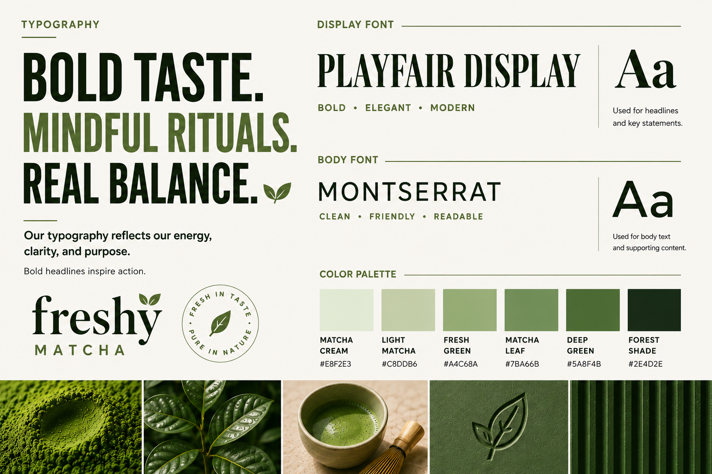
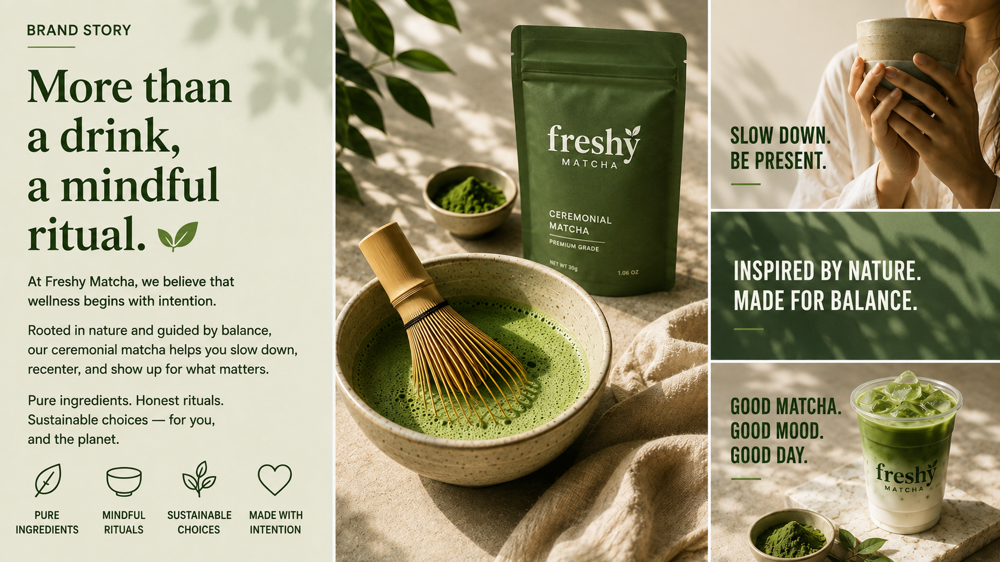

<div align="center">
  

  <h1>Freshy Matcha · Brand Identity Builder</h1>
  <p><strong>An approval-led n8n system for turning a creative brief into a complete, reviewed brand identity and campaign asset package.</strong></p>

  <p>
    <a href="n8n%20system/Brand%20Identity%20Builder.json">Workflow export</a> ·
    <a href="brand/Freshy_Matcha_advertisement_design_202608291218.mp4">Open the MP4 commercial</a> ·
    <a href="brand/">Browse all brand assets</a>
  </p>
</div>

> **Fresh in taste. Pure in nature.**
>
> Freshy Matcha is positioned as more than a drink: a mindful ritual rooted in pure ingredients, honest choices, balance, and intention.


## 01 · Project overview

**Brand Identity Builder** is an n8n workflow for creative operations. It guides a customer from an initial brand brief through proposal approval, AI-assisted identity generation, campaign production, human review, and final delivery.

The repository uses Freshy Matcha as the reference brand and visual case study. The system is designed to make brand production repeatable without removing the creative checkpoints that protect quality, consistency, and client alignment.

## 02 · What the system does

| Capability | Outcome |
| --- | --- |
| **Guided intake** | Captures brand concept, logo status, existing assets, contact details, and requested deliverables through n8n Forms. |
| **Conditional briefing** | Requests image or video direction only when those deliverables are selected. |
| **Proposal approval** | Generates a creative proposal and pauses production until approval is received. |
| **Identity generation** | Produces structured brand identity direction from the approved brief. |
| **Image production** | Creates image prompts, generates campaign visuals, uploads them, and shares them for review. |
| **Video production** | Creates video prompts and coordinates short-form brand video generation and collection. |
| **Review loops** | Supports owner review, customer review, change requests, and re-approval. |
| **Delivery** | Sends final identity and approved campaign assets through the configured delivery flow. |

## 03 · Automation architecture


The workflow is organized as a controlled production pipeline rather than a single generation step.

| Phase | Process |
| --- | --- |
| **Brief** | Brand Identity Form → Deliverables Page → conditional image/video direction pages |
| **Proposal** | Collect Form Data → Save Submission → Generate Proposal → approval email |
| **Create** | Generate Brand Identity → generate image and video prompts → produce selected assets |
| **Prepare** | Collect generated links → upload assets to Google Drive → configure sharing |
| **Review** | Owner review → customer review → change loop or approval |
| **Deliver** | Send the approved identity document and campaign assets to the customer |

## 04 · Brand direction

Freshy Matcha combines editorial sophistication with a calm, natural product world. The creative system is deliberately restrained: forest greens and matcha tones carry the brand, warm neutrals create breathing room, and tactile product photography makes the ritual feel tangible.


| Brand attribute | Direction |
| --- | --- |
| **Positioning** | A mindful matcha ritual for slowing down, recentering, and showing up with intention. |
| **Values** | Pure ingredients, mindful rituals, sustainable choices, and care in every interaction. |
| **Voice** | Calm, confident, warm, intentional, and quietly premium. |
| **Photography** | Natural sunlight, leaf shadows, ceramic, stone, bamboo, matcha powder, and product-first compositions. |
| **Typography** | Playfair Display for editorial headlines; Montserrat for clear supporting copy. |

## 05 · Brand applications


The identity is built to travel across packaging, stationery, cups, envelopes, seals, social content, and campaign layouts. Its dark presentation mode uses cream typography and matcha-green accents to create a premium contrast without losing the natural character of the brand.

## 06 · Color system


| Color | Hex | Function |
| --- | --- | --- |
| Matcha Cream | `#E8F2E3` | Fresh, clean background |
| Light Matcha | `#C8DDB6` | Calm supporting tone |
| Fresh Green | `#A4C68A` | Natural accent |
| Matcha Leaf | `#7BA66B` | Vibrant mid-tone |
| Deep Green | `#5A8F4B` | Strong brand accent |
| Forest Shade | `#2E4D2E` | Premium contrast and grounding |
| Soft Cream | `#F6F6F1` | Warm neutral canvas |
| Natural Clay | `#E7E3D9` | Earthy neutral accent |
| Matcha Stone | `#2A2A27` | High-contrast text |

## 07 · Typography system



**Playfair Display** provides the distinctive editorial voice for headlines and key statements. **Montserrat** keeps body copy, labels, and supporting information modern, friendly, and readable. Together they express the project’s central balance: ritual and clarity, heritage and contemporary restraint.

## 08 · Commercial film

The commercial is included in two complementary formats: an inline animated preview that plays directly in GitHub’s README view, and the original MP4 for full-quality playback with audio.

<div align="center">
  <a href="brand/Freshy_Matcha_advertisement_design_202608291218.mp4">
    
  </a>
  <p><strong>Click the animated preview to open the original MP4 commercial.</strong></p>
</div>

The eight-second film opens on **“FRESH IN TASTE, PURE IN NATURE”**, transitions from a split-screen editorial treatment into a product hero, and closes with a mindful lifestyle message. The pacing is slow and rhythmic, with natural sunlight, leaf shadows, a ceremonial matcha bowl, pouch, and tin reinforcing the brand’s calm premium tone.

> **Playback note:** GitHub can display the animated preview directly in the README. The original MP4 is linked from the preview and from the project links above so it can be opened with native video controls and audio.

## 09 · Repository map

```text
.
├── README.md
├── brand/
│   ├── FreshyMatcha-logo.png
│   ├── Freshy_Matcha_advertisement_design_202608291218.mp4
│   ├── Freshy_Matcha_advertisement_preview.gif
│   ├── brand1.png
│   ├── brand2.png
│   ├── brandstory.png
│   ├── brandstory2.png
│   ├── colorPalette.png
│   └── typography.png
└── n8n system/
    ├── Brand Identity Builder.json
    └── automationWorkflow.png
```

| Location | Purpose |
| --- | --- |
| `brand/` | Complete Freshy Matcha identity, application boards, palette, typography, logo, and commercial assets. |
| `n8n system/` | Importable n8n workflow export and architecture reference. |

## 10 · Setup

### Requirements

Use an n8n instance with permission to import workflows, SMTP access for transactional email, Google Drive access for asset storage and sharing, the AI credentials expected by the workflow nodes, and an available n8n Data Table for submission history.

### Import and configure

1. Import [`Brand Identity Builder.json`](n8n%20system/Brand%20Identity%20Builder.json) into n8n.
2. Replace the exported credential mappings with credentials from your own workspace.
3. Confirm the submission Data Table and its mapped columns.
4. Review AI generation nodes, HTTP request endpoints, email routing, approval URLs, and Google Drive destinations.
5. Test with non-production recipients and storage before activation.
6. Activate the workflow only after the proposal, review, and delivery paths have been tested end to end.

| Configuration area | Check before production |
| --- | --- |
| **AI providers** | OpenAI and Google Gemini credentials are connected to the intended nodes. |
| **Email** | SMTP sender, recipients, approval links, and change-request routing are correct. |
| **Google Drive** | Upload destinations and public-sharing behavior meet your organization’s policy. |
| **External services** | HTTP endpoints, authentication, payloads, and response fields match the selected generation services. |
| **Security** | Secrets remain in n8n credentials, and public asset sharing is intentional. |

## 11 · Why the approval model matters

The system is designed for **repeatable creative production with human control**. A submitted brief is recorded, a proposal is reviewed before generation, assets are checked by the owner and customer, and requested changes can return to the appropriate loop. This keeps the creative process transparent while reducing repetitive coordination work.

## 12 · Additional reference



The light brand-story board demonstrates the same identity in a softer editorial treatment: cream space, natural light, tactile materials, and concise messaging around presence, balance, and mindful ritual.

## References

1. [`Brand Identity Builder.json`](n8n%20system/Brand%20Identity%20Builder.json) — importable n8n workflow.
2. [`automationWorkflow.png`](n8n%20system/automationWorkflow.png) — workflow architecture overview.
3. [`brand/`](brand/) — complete visual identity and campaign asset package.
4. [`Freshy_Matcha_advertisement_design_202608291218.mp4`](brand/Freshy_Matcha_advertisement_design_202608291218.mp4) — original commercial video.

<div align="center">
  <sub>Built for thoughtful, repeatable brand production.</sub>
</div>
