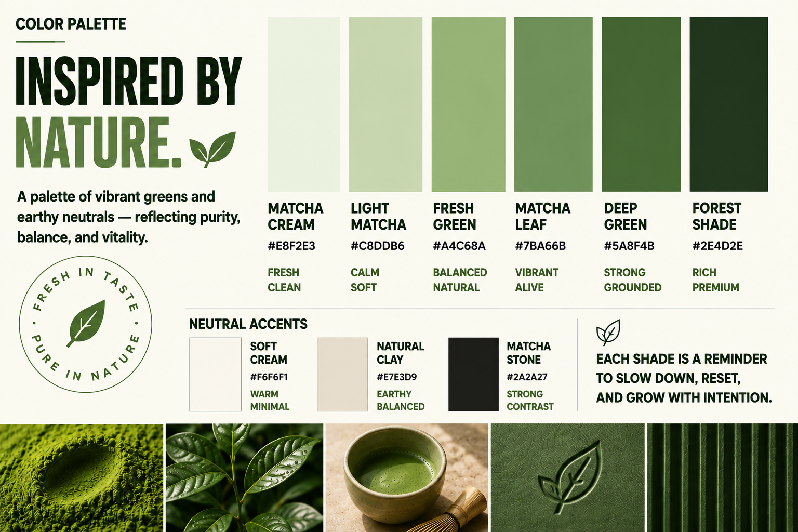

<div align="center">
  

  <h1>Freshy Matcha · Brand Identity Builder</h1>

  <p><strong>An approval-led n8n automation system for turning a creative brief into a complete, on-brand identity and campaign asset package.</strong></p>

  <p>
    <a href="n8n%20system/Brand%20Identity%20Builder.json">Workflow export</a> ·
    <a href="brand/Freshy_Matcha_advertisement_design_202608291218.mp4">Watch the commercial</a> ·
    <a href="brand/">Browse brand assets</a>
  </p>
</div>

> **Fresh in taste. Pure in nature.**
>
> Freshy Matcha is presented as more than a drink: it is a mindful ritual rooted in pure ingredients, honest choices, balance, and intention.


## Overview

**Brand Identity Builder** is an n8n workflow that guides a customer from an initial brand brief to a reviewed and deliverable-ready identity package. It combines conditional intake forms, structured data capture, AI-assisted creative generation, Google Drive asset handling, approval checkpoints, and email notifications in one orchestrated flow.

The repository uses **Freshy Matcha** as the reference brand. Its visual direction is organic minimalism: forest greens, matcha tones, warm neutrals, editorial typography, natural light, and a calm premium mood. The included images and commercial demonstrate the intended output language rather than functioning as generic placeholders.

## What the workflow delivers

| Capability | What it does |
| --- | --- |
| **Guided intake** | Collects brand name, concept, logo status, existing assets, contact details, and requested deliverables through n8n Forms. |
| **Conditional briefing** | Shows image or video direction pages only when the selected deliverables require them, keeping the brief focused. |
| **Creative proposal** | Generates a proposal for review before asset generation begins. |
| **Identity generation** | Produces a structured brand identity direction from the approved brief. |
| **Campaign imagery** | Generates image prompts and coordinates image creation, collection, upload, and public sharing. |
| **Brand video** | Generates video prompts and coordinates short-form video production, collection, upload, and public sharing. |
| **Review gates** | Separates customer approval, owner review, and asset approval so creative work remains controlled and auditable. |
| **Delivery operations** | Stores submissions, sends status emails, and delivers approved brand identity and campaign assets. |

## Workflow at a glance


The automation is organized around five stages:

| Stage | Flow |
| --- | --- |
| **1 · Brief** | Brand Identity Form → Deliverables Page → conditional image/video direction pages |
| **2 · Proposal** | Collect Form Data → Save Submission → Generate Proposal → Send Approval Email |
| **3 · Identity** | Approval gate → Generate Brand Identity → Generate Image Prompts / Generate Video Prompts |
| **4 · Production** | Generate Images / Generate Videos → upload to Google Drive → make assets publicly accessible |
| **5 · Review & delivery** | Owner review → customer review → change loop or final brand identity and asset delivery |

## The Freshy Matcha creative system

The reference identity is designed to feel **fresh, natural, calm, and premium**. The system pairs a refined editorial display style with an approachable sans-serif body style, creating a visual balance between ritual and modern clarity.


| Element | Direction |
| --- | --- |
| **Core promise** | Fresh in taste, pure in nature. |
| **Brand story** | More than a drink: a mindful ritual. |
| **Values** | Pure ingredients, mindful rituals, sustainable choices, and made with intention. |
| **Display typography** | Playfair Display for headlines and key statements. |
| **Body typography** | Montserrat for readable supporting content. |
| **Visual motifs** | Matcha powder, tea leaves, bamboo whisk, ceramic chawan, stone, clay, and leaf shadows. |
| **Photography mood** | Warm natural light, organic textures, restrained composition, and product-first storytelling. |

### Color palette



| Name | Hex | Role |
| --- | --- | --- |
| Matcha Cream | `#E8F2E3` | Fresh, clean background tone |
| Light Matcha | `#C8DDB6` | Calm, soft supporting color |
| Fresh Green | `#A4C68A` | Balanced natural accent |
| Matcha Leaf | `#7BA66B` | Vibrant, alive mid-tone |
| Deep Green | `#5A8F4B` | Strong brand accent |
| Forest Shade | `#2E4D2E` | Rich, grounded, premium contrast |
| Soft Cream | `#F6F6F1` | Warm neutral canvas |
| Natural Clay | `#E7E3D9` | Earthy neutral accent |
| Matcha Stone | `#2A2A27` | High-contrast text and details |

## Commercial preview

<div align="center">
  <video controls width="820" preload="metadata" aria-label="Freshy Matcha 8-second commercial">
    <source src="https://github.com/ayarihanine/brand-identity-n8n-system/raw/refs/heads/main/brand/Freshy_Matcha_advertisement_design_202608291218.mp4" type="video/mp4" />
    <a href="brand/Freshy_Matcha_advertisement_design_202608291218.mp4">Open the Freshy Matcha commercial video</a>
  </video>
  <p><em>Freshy Matcha commercial · 8 seconds · click the controls to play.</em></p>
</div>

The commercial opens with the line **“FRESH IN TASTE, PURE IN NATURE”**, transitions from a split-screen editorial layout into a product hero composition, and closes on a mindful lifestyle message. Its slow, rhythmic pacing, natural sunlight, leaf shadows, matcha bowl, pouch, and tin are consistent with the identity system documented in this repository.

> **Production note:** The commercial is embedded directly with an HTML5 video player and includes a repository-relative fallback link. If a GitHub client does not render the player, use the fallback link inside the video block to open the committed MP4.

## Repository structure

```text
.
├── README.md
├── brand/
│   ├── FreshyMatcha-logo.png
│   ├── Freshy_Matcha_advertisement_design_202608291218.mp4
│   ├── brand1.png
│   ├── brand2.png
│   ├── brandstory.png
│   ├── brandstory2.png
│   ├── colorPalette.png
│   └── typography.png
└── n8n system/
    ├── Brand Identity Builder.json
    └── automationWorkflow.png
```

| Directory | Purpose |
| --- | --- |
| `brand/` | Reference identity system, packaging and application boards, palette, typography, logo, and commercial video. |
| `n8n system/` | Importable n8n workflow export and workflow overview image. |

## Getting started

### Requirements

You need an n8n instance with permission to import workflows, an SMTP account for transactional email, Google Drive access for asset storage and sharing, and the AI credentials expected by the workflow nodes. The exported workflow also uses n8n Data Tables for submission history and HTTP requests for external generation steps.

### Import the workflow

1. Open your n8n workspace.
2. Import [`n8n system/Brand Identity Builder.json`](n8n%20system/Brand%20Identity%20Builder.json).
3. Review every credential reference and replace the exported credential mappings with credentials from your own n8n instance.
4. Confirm the Data Table used by the submission-storage nodes is available in the target workspace.
5. Review the generation endpoints, email sender settings, Google Drive destination, and approval URLs before activation.
6. Activate the workflow and submit a test brief using non-production recipient and storage settings.

### Credential and environment checklist

| Area | Verify before activation |
| --- | --- |
| **AI** | OpenAI and Google Gemini credentials are connected to the intended generation nodes. |
| **Email** | SMTP credentials, sender identity, recipient routing, and approval links are correct. |
| **Google Drive** | Upload folders and public-sharing behavior match your organization’s policy. |
| **Data storage** | The submission Data Table exists and its columns match the workflow mappings. |
| **External APIs** | HTTP request URLs, authentication, payloads, and response fields are valid for the selected generation services. |
| **Security** | Public sharing is intentional, secrets are managed in n8n credentials, and test data is removed before production use. |

## Review and approval model

The workflow is intentionally not a fire-and-forget generator. A brief is saved, a proposal is sent for approval, and generated assets pass through owner and customer review gates. If changes are requested, the workflow routes the request back into the appropriate review loop; if approved, it sends the final identity and asset package.

This structure makes the system suitable for repeatable creative operations: it preserves a record of the brief, creates clear hand-off points, and keeps production separate from final delivery.

## Asset index

The repository keeps the complete source package available without repeating the same visuals throughout this README. Use the links below to open the remaining references directly.

| Asset | Use |
| --- | --- |
| [`brand2.png`](brand/brand2.png) | Dark presentation board with packaging and applications |
| [`brandstory.png`](brand/brandstory.png) | Light brand-story composition |
| [`typography.png`](brand/typography.png) | Typography and visual-system reference |
| [`FreshyMatcha-logo.png`](brand/FreshyMatcha-logo.png) | Primary logo artwork |

## Notes

The repository contains a complete workflow export and visual reference package. Credentials, Data Table identifiers, external generation services, email settings, and Google Drive destinations should be treated as environment-specific configuration and reviewed before deployment.

## References

1. [`Brand Identity Builder.json`](n8n%20system/Brand%20Identity%20Builder.json) — exported n8n workflow configuration.
2. [`automationWorkflow.png`](n8n%20system/automationWorkflow.png) — workflow overview diagram.
3. [`brand/`](brand/) — Freshy Matcha visual identity references and campaign assets.
4. [`Freshy_Matcha_advertisement_design_202608291218.mp4`](brand/Freshy_Matcha_advertisement_design_202608291218.mp4) — reference ad commercial.

<div align="center">
  <sub>Built for thoughtful, repeatable brand production.</sub>
</div>
